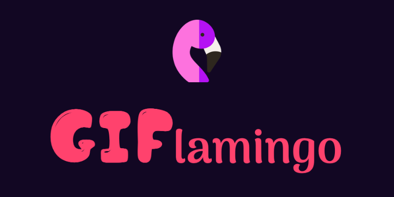
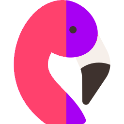
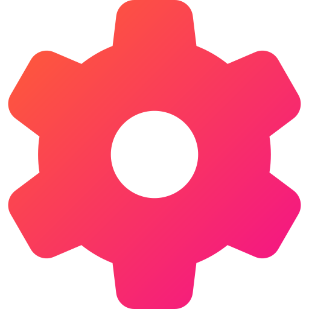
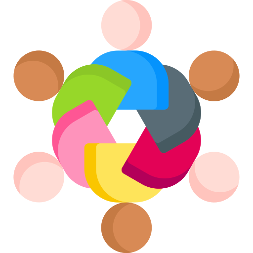

`GIFlamingo` is your one-stop-shop for all the best GIFs out there!

**Languages:**    

**Browsers:**      

##  Why GIFlamingo?

- Clean user-interface geared towards maximum GIF-enjoyment;
- Quick navigation and access to content;
- No-registration needed for using profile functionality (favorite GIF and uploading your own GIFs);
- Simple, rapid, user-friendly.

##  Features

- Quick-view on the **latest trends** in the realm of GIFs right from the `Home` page:
  - top `trending GIFs`;
  - the most `popular search terms` within the community (click on any one of them to view its search results);
  - test your luck and pull the trigger on a random gif with the `GIF-me!` button.
- Endlessly **browse** the latest "Trending GIFs" from the `Trending` tab;
- Easily **search** for any GIFs that you may want to see by simply typing in keywords in the `search-bar`;
- Check up on your **profile** from the `My Profile` tab to upload your own GIFs for the world to see and also browse the GIFs you already have in your GIFlamingo nest:
  - if you feel bored of your nest, you can always empty it out with the `Empty my nest` button and start anew!
- Crown any GIF you come across as your personal **favorite** from the heart icon next to its title and quick-access it anytime from the `Favorite` floating bubble!
- **Have fun!** ;)

##  Getting Started

1. Open terminal in `gif-project` directory;
2. Run `npm install` command to install project dependencies;
3. Run `npm run docs` command to generate JSDoc html in `gif-project/out/` directory.
4. Run `live-server` within `gif-project` directory;
5. Enjoy an endless world of GIF content from your browser!

##  Frequently Asked Questions

- **Where is the search button? How do I search GIFs?**
  - `GIFlamingo` offers a dynamic search functionality where all you need to do to search is to type in your desired keywords. The search mechanism will dynamically update search results based on your keyword input as you type it in. Easy as pie, right?
- **Why does the favorite bubble opens up a random GIF?**
  - If you haven't yet selected a GIF as your personal favorite, clicking the `Favorite` bubble will present you with a random GIF you might like in the hopes of you finding your favorite as soon as possible.
- **Different favorite GIF and uploaded GIFs only show up on my different browsers - why is that?**
  - `GIFlamingo` stores information regarding your favorite GIF and your profile's uploaded GIFs in the `localStorage()` of your browser. Therefore, a GIF you have chosen as your favorite when opening the website on Google Chrome, will not be recorded as favorite when opening it on Safari, for example.

##  Community and Contributions

The `GIFlamingo` platform is developed by the infamous **Team 16** (Simona Ilcheva and Samuil Sarandev).

The creators vow to engage in open, two-sided communication with the platform's community to seek ongoing improvements to the platform and betterment of the overall user experience on `GIFlamingo`.

Our team works very hard, day and night, to provide you with the best possible experience of the GIF realm. *Forever-free-of-charge.* Therefore, please consider supporting our efforts by donating to keep our operation going:

- **Revolut** handle: `@samusar`

##  External Resources

The `GIFlamingo` platform is powered by **GIPHY**'s proprietary `API` in agreement with their provided *Terms and Conditions* for fair usage.